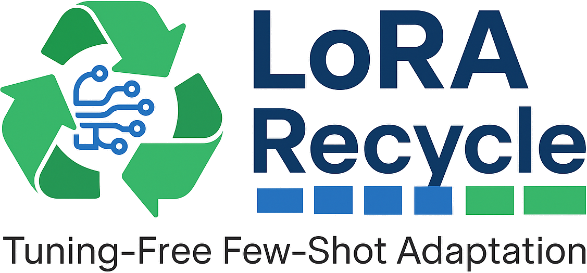
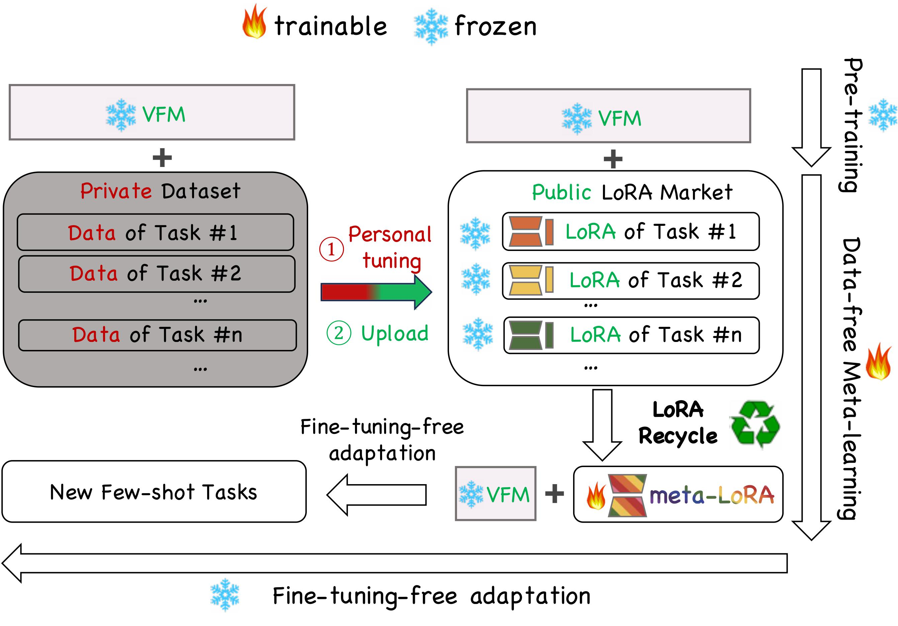
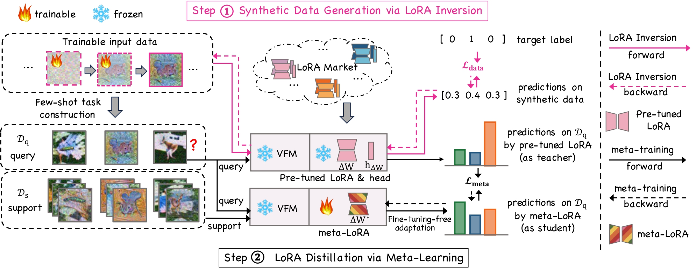
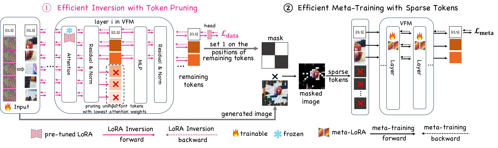
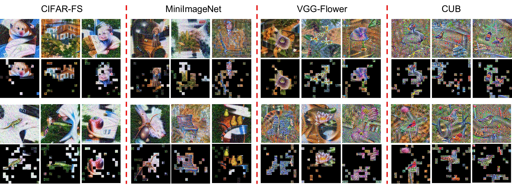

<p align="center">
  
</p>
<!-- 链接 -->
<p align="center">
  <a href="https://openaccess.thecvf.com/content/CVPR2025/papers/Hu_LoRA_Recycle_Unlocking_Tuning-Free_Few-Shot_Adaptability_in_Visual_Foundation_Models_CVPR_2025_paper.pdf">📝 Paper</a> &nbsp;|&nbsp;
  <a href="https://github.com/Egg-Hu/LoRA-Recycle">📑 Slide</a> &nbsp;|&nbsp;
  <a href="https://github.com/Egg-Hu/LoRA-Recycle">📌 Poster</a>
</p>

<!-- 标题 -->
<h2 align="center">[CVPR 2025] LoRA Recycle: Unlocking Tuning-Free Few-Shot Adaptability in Visual Foundation Models by Recycling Pre-Tuned LoRAs</h2>


### 🚀 Motivation of LoRA Recycle

<p align="center">
  
</p>

Thanks to the modularity of LoRA, users can upload locally tuned LoRAs to public repositories without exposing original training data.  
LoRA Recycle distills a meta-LoRA from these LoRAs without needing their original training data.  
The VFM, once equipped with the meta-LoRA, is empowered to solve new few-shot tasks in a single forward pass without further fine-tuning.

---

### 🔥 Pipeline of LoRA Recycle

<p align="center">
  
</p>

---

### 🌱 Sparse Synthetic Data Generation

<p align="center">
  
</p>


## ⚙️ Requirements

```bash
pip install -r requirements.txt
```

## 📂 Datasets
1) Download

   In our paper, we use eight datasets.
For In-Domain setting, we use CIFAR-FS, MiniImageNet, VGG-Flower and CUB-200-2011.
For Cross-Domain setting, we use ChestX, ISIC, EuroSAT and CropDiseases.

2) Generate split csv files of meta-training and meta-testing subsets

   Reset the DATA_PATH (the path to the downloaded dataset) and SPLIT_PATH (the path to save the generated csv file) in each file under ./write_file.
    
    Run the following scripts to generate the split csv files of meta-training and meta-testing subsets.
    ```bash
    python ./write_file/write_cifarfs_filelist.py
    python ./write_file/write_miniimagenet_filelist.py
    python ./write_file/write_flower_filelist.py
    python ./write_file/write_cub_filelist.py
    python ./write_file/write_cropdiseases_filelist.py
    python ./write_file/write_eurosat_filelist.py
    python ./write_file/write_isic_filelist.py
    python ./write_file/write_chest_filelist.py
    ```

3) Reset the SPLIT_PATH (the path to the generated split csv files) in each file under ./dataset.
## 🚀 Quick Start
- In-Domain Setting.
  ```bash
  python main.py \
  --multigpu 6 \
  --gpu 0 \
  --dataset flower \
  --testdataset flower \
  --val_interval 100 \
  --backbone base_clip_16 \
  --resolution 224 \
  --method pre_dfmeta_ft \
  --episode_batch 1 \
  --way_train 5 \
  --num_sup_train 1 \
  --num_qur_train 15 \
  --way_test 5 \
  --num_sup_test 1 \
  --num_qur_test 15 \
  --episode_train 240000 \
  --episode_test 100 \
  --outer_lr 1e-3 \
  --rank 4 \
  --synthesizer inversion \
  --prune_layer -1 \
  --prune_ratio 0.0 \
  --mask_ratio -1 \
  --pre_datapool_path you_should_input_the_path_to_pre-inverted_data
  
  key arguments:
  --dataset: meta-training on inverted data from flower/cifar100/miniimagenet/cub
  --testdataset: meta-testing on real data from flower/cifar100/miniimagenet/cub
  --val_interval: validation interval (iterations)
  --backbone: base_clip_16/base_clip_32, 16/32 indicates the patch size
  --resolution: resolution of images
  --episode_batch: batch size of tasks at one iteration
  --way_train/test: the number of classes during meta-training/testing
  --num_sup_train/test: the number of shot during meta-training/testing
  --episode_train: total number of iterations of meta-training
  --episode_test: number of meta-testing tasks
  --outer_lr: learning rate
  --rank: rank of lora
  --prune_layer: the layers to perform token pruning, 
                 -1 indicates no token pruning
                 l1, l2, ..., ln: perform token pruning at l1, l2, ..., ln
  --prune_ratio: the proportion of tokens to be pruned, relative to the current remaining tokens
                0: indicates no token pruning
                r1 r2 ... rn: progressively prune a fraction (r1, r2, ..., rn) of patches at layers (l1, l2, ..., ln), respectively
  --mask_ratio:
                -1: automatically mask the inverted data based on the positions of remaining tokens
                x: mask extra remaining tokens after the last layer
  --pre_datapool_path: path to the pre-inverted data
  ```
- Cross-Domain Setting.
  ```bash
  python main.py \
  --multigpu 6 \
  --gpu 0 \
  --dataset mix \
  --testdataset cropdiseases \
  --val_interval 100 \
  --backbone base_clip_16 \
  --resolution 224 \
  --method pre_dfmeta_ft \
  --episode_batch 1 \
  --way_train 5 \
  --num_sup_train 1 \
  --num_qur_train 15 \
  --way_test 5 \
  --num_sup_test 1 \
  --num_qur_test 15 \
  --episode_train 240000 \
  --episode_test 100 \
  --outer_lr 1e-3 \
  --rank 4 \
  --synthesizer inversion \
  --prune_layer -1 \
  --prune_ratio 0.0 \
  --mask_ratio -1 \
  --pre_datapool_path you_should_input_the_path_to_pre-inverted_data
  
  key arguments:
  --dataset: meta-training on inverted data from flower+cifar100+miniimagenet+cub
  --testdataset: meta-testing on real data from cropdiseases/eurosat/isic/chest
  --val_interval: validation interval (iterations)
  --backbone: base_clip_16/base_clip_32, 16/32 indicates the patch size
  --resolution: resolution of images
  --episode_batch: batch size of tasks at one iteration
  --way_train/test: the number of classes during meta-training/testing
  --num_sup_train/test: the number of shot during meta-training/testing
  --episode_train: total number of iterations of meta-training
  --episode_test: number of meta-testing tasks
  --outer_lr: learning rate
  --rank: rank of lora
  --prune_layer: the layers to perform token pruning, 
                 -1 indicates no token pruning
                 l1, l2, ..., ln: perform token pruning at l1, l2, ..., ln
  --prune_ratio: the proportion of tokens to be pruned, relative to the current remaining tokens
                0: indicates no token pruning
                r1 r2 ... rn: progressively prune a fraction (r1, r2, ..., rn) of patches at layers (l1, l2, ..., ln), respectively
  --mask_ratio:
                -1: automatically mask the inverted data based on the positions of remaining tokens
                x: mask extra remaining tokens after the last layer
  --pre_datapool_path: path to the pre-inverted data
  ```
## 🖼️ Visualization
  ```bash
  python main.py \
  --multigpu 6 \
  --gpu 0 \
  --dataset flower \
  --testdataset flower \
  --val_interval 100 \
  --backbone base_clip_16 \
  --resolution 224 \
  --method pre_dfmeta_ft \
  --episode_batch 1 \
  --way_train 5 \
  --num_sup_train 5 \
  --num_qur_train 15 \
  --way_test 5 \
  --num_sup_test 5 \
  --num_qur_test 15 \
  --episode_train 240000 \
  --episode_test 100 \
  --outer_lr 1e-3 \
  --rank 4 \
  --synthesizer inversion \
  --prune_layer -1 \
  --prune_ratio 0.0 \
  --mask_ratio -1 \
  --pre_datapool_path you_should_input_the_path_to_pre-inverted_data \
  --preGenerate
  
  key arguments:
  --preGenerate: set True for inversion
  --pre_datapool_path you should input_the path to save the inverted data
  other arguments are the same as mentioned above
  ```


## 🧩 Pre-trained ViTs

You can download the pre-trained ViT from the following public link.

```bash
https://huggingface.co/openai/clip-vit-base-patch16
https://huggingface.co/openai/clip-vit-base-patch32
````

## 🧩 Pre-Tuned LoRAs


You can put the pre-trained LoRA into the following folder.

```bash
./lorahub
```

## 🖼️ Pre-Inverted Data

Please connect me if you need the examples of inverted synthetic images.


<!-- We will provide data inverted from LoRAs pre-tuned on different datasets in the following directory (including unmasked and 25%/50%/75%-masked versions). -->
<!-- 
```bash
```bash
./pre_datapool
``` -->

## 📖 Citation
Please cite our paper if you find it helpful :)
```bash
@InProceedings{Hu_2025_CVPR,
    author    = {Hu, Zixuan and Wei, Yongxian and Shen, Li and Yuan, Chun and Tao, Dacheng},
    title     = {LoRA Recycle: Unlocking Tuning-Free Few-Shot Adaptability in Visual Foundation Models by Recycling Pre-Tuned LoRAs},
    booktitle = {Proceedings of the Computer Vision and Pattern Recognition Conference (CVPR)},
    month     = {June},
    year      = {2025},
    pages     = {25026-25037}
}
```
